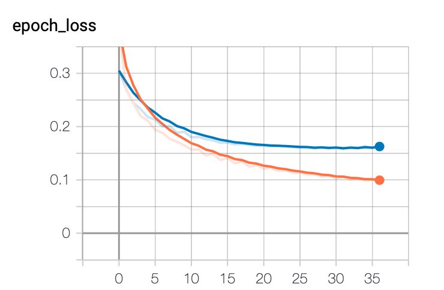
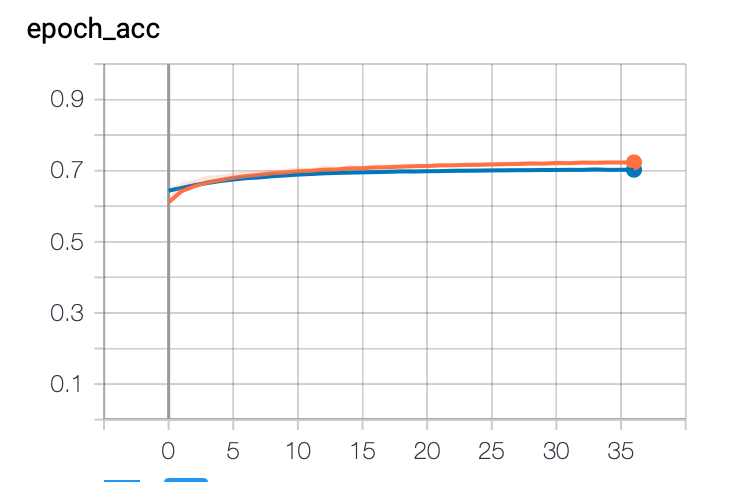

# 用BiLSTM实现中文分词


# 1. 使用效果

## 1.1 输入

输入待分词的句子或文章，如：

> 黑夜给了我黑色的眼睛，我却用它寻找光明。

## 1.2 输出

返回分词结果：

> 黑夜/给/了/我/黑色/的/眼睛/，/我/却/用/它/寻找/光明/。

# 2. 使用过程

将中文分词视作一个**序列标注**任务。

1. 训练数据预处理：对已经标注好分词的训练数据加上4元组标注['**B**egin', '**M**iddle', '**E**nd', '**S**ingle']，分别表示一个词语的开始、中间、结尾以及单字词语。
2. 模型训练：训练BiLSTM模型，保存模型。
3. 模型预测：加载模型，对测试语句进行序列标注，当得到标注为E或者S，则在该字符处切割。


# 3. 数据预处理

1. 字符频度统计，得到char_count_dict: {char: count}。

2. 建立字符字典，根据字符频度过滤低频度字符；建立字符词典char2id_dict：{char: index}。

   （1）为序列补齐，预留index=0。后续在批量模型训练时，数据需要相同长度，如果序列实际长度不足，可以通过在序列后面补pad字符将序列对齐，在计算loss的时候将pad字符所在位置mask掉，不计算这部分字符的loss。

   （2）为未知字符'<unk>'预留index=1。

3. 训练数据生成：建立字符到index的映射，不在字典中的字符index=1。每一行是相等字符的字符index序列与标注序列。

   > 101,8,890,234,7,0,0 '\t'   4123400

# 4. 模型训练

## 4.1 模型设计

用了最简单的设计，只有一层LSTM结构（双向）。

1. Embedding层的输入维度是vocab_size+2，1用于未知字符`unk`，0用于补齐字符`pad`。
2. 输出层Dense的输出维度是5，分别表示：`{0: pad, 1: B, 2: M, 3: E, 4: S}`。

```python
class RNNSeg(tf.keras.Model):
    def __init__(self, vocab_size=10,
                 num_states=4,
                 embedding_dim=16,
                 rnn_units=8):
        super(RNNSeg, self).__init__()

        # 0 for `pad`, 1 for `unk`
        self.embedding_layer = Embedding(input_dim=vocab_size+2,
                                         output_dim=embedding_dim)

        # merge_mode: sum, mul, concat, ave. Default is `concat`.
        self.bi_lstm_layer = Bidirectional(LSTM(units=rnn_units, return_sequences=True),
                                           merge_mode="ave")
        # 4-tag: B, M, E, S, `0` for pad
        self.dense_layer = Dense(units=5, activation='softmax')

    def call(self, inputs, training=None, mask=None):
        # inputs: [None, steps]

        # embedding: [None, steps, embedding_dim]
        embedding = self.embedding_layer(inputs)

        # rnn: [None, steps, rnn_units]
        rnn = self.bi_lstm_layer(embedding)

        # softmax: [None, steps, 4]
        softmax = self.dense_layer(rnn)

        return softmax
```


## 4.2 损失函数

1. 因为是多分类，损失函数采用sparse_categorical_crossentropy。
2. 序列后部可能存在补齐字符0，y_true如果为0，则将该位置的loss置成0。

```python
from tensorflow.keras.losses import sparse_categorical_crossentropy

def mask_sparse_cross_entropy(y_true=None, y_pred=None, mask=0):
    # y_true: [None, steps]
    # y_pred: [None, steps, num_classes+1], +1 for pad to mask

    # loss: [None, steps]
    loss = sparse_categorical_crossentropy(y_true, y_pred)

    # masks: [None, steps]
    masks = tf.cast(tf.not_equal(y_true, mask), tf.float32)

    # masked-loss: [None, steps]
    loss = tf.multiply(loss, masks)

    # reduce_mean: shape=()
    loss = tf.cast(tf.reduce_mean(loss), tf.float32)

    return loss
```


## 4.3 数据预处理

将数据处理成tensorflow.data.Dataset，从而可以用数据流的形式处理超大数据集。

```python
def dataset_generator(data_path=None,
                      epochs=10,
                      shuffle_buffer_size=1024,
                      batch_size=16,
                      steps=10,
                      pad_index=0,
                      char2id_dict=None):
    # input_data: char_idx :: char_idx :: char_idx \t state_idx \s state_idx \s state_idx
    
    def generator():
        with open(data_path, 'r', encoding='utf-8') as f:
            for line in f:
                buf = line[:-1].split('\t')
                chars = buf[0].split('::')
                states = list(buf[1]) # labels are split by space.

                if len(chars) != len(states):
                    continue
								
                # The sequence length of trainning is fixed.
                for i in range(len(chars) // steps + 1):
                    sub_chars = []
                    for char in chars[i*steps: min((i+1)*steps, len(chars))]:
                        if char in char2id_dict:
                            sub_chars.append(char2id_dict[char])
                        else:
                            sub_chars.append(1) # 1 for `unk`, 0 for `pad`
                            
                    sub_states = states[i*steps: min((i+1)*steps, len(chars))]
										
                    # Pad `0` to complete the sequence if needed.
                    inputs = sub_chars if len(sub_chars) == steps \
                        else pad_sequence(seq=sub_chars, max_len=steps, pad_index=pad_index)
                    outputs = sub_states if len(sub_states) == steps \
                        else pad_sequence(seq=sub_states, max_len=steps, pad_index=pad_index)
										
                    # inputs:  char_index_list
                    # outputs: state_index_list
                    yield inputs, outputs
		
    # === Build tf.data.Dataset from generator.
    dataset = tf.data.Dataset.from_generator(generator,
                                             output_shapes=((steps, ), (steps, )),
                                             output_types=(tf.int32, tf.int32))
		# === Repeat, shuffle, generate in batch.
    return dataset.repeat(epochs)\
        .shuffle(buffer_size=shuffle_buffer_size)\
        .batch(batch_size=batch_size)
```


## 4.4 模型训练

定义好模型、优化器、损失函数，加入一些callbacks，用tf.keras.Model默认的fit方式进行训练。

```python
# === model
rnnseg = RNNSeg(vocab_size=vocab_size, embedding_dim=embedding_dim, rnn_units=rnn_units)
# optimizer
optimizer = tf.keras.optimizers.Adam(0.001)

rnnseg.compile(optimizer=optimizer,
               loss=mask_sparse_cross_entropy,
               metrics=['acc'])

# callbacks
callbacks = []

early_stopping_cb = EarlyStopping(monitor='val_loss',
                                patience=5, restore_best_weights=True)
callbacks.append(early_stopping_cb)

tensorboard_cb = TensorBoard(log_dir=os.path.join(get_log_dir(), "rnn_model"))
callbacks.append(tensorboard_cb)

checkpoint_path = os.path.join(get_model_dir(), "rnn_model", "ckpt")
checkpoint_cb = ModelCheckpoint(filepath=checkpoint_path,
                                save_weights_only=True,
                                save_best_only=True)
callbacks.append(checkpoint_cb)

# === Train
history = rnnseg.fit(train_dataset,
           batch_size=batch_size,
           epochs=epochs,
           steps_per_epoch=num_train_batch,
           validation_data=val_dataset,
           validation_steps=num_val_batch,
           callbacks=callbacks)
```


监测val_loss，如果超过5个epoch效果不提升就停止训练。

用tensorboard观察训练效果，模型在大概30轮的时候收敛了。







# 5. 模型测试

测试的时候，使用一个简单的trick，根据中英文的标点符号断句，将每一个断句输入BiLSTM网络进行预测。


# 6. 模型评估

可以看出，一个简单的单层BiLSTM可以得到还不错的效果，但是依然没有超过基于词典匹配的算法。

一些优化点：

1. 增加模型复杂度：如增加LSTM的层数。
2. 加入防过拟合手段：Dropout、BatchNormalization等。


| 模型         | Precision  | Recall     | F1_score   |
| ------------ | ---------- | ---------- | ---------- |
| 正向最大匹配 | 0.9120     | **0.9541** | **0.9325** |
| 反向最大匹配 | 0.9101     | 0.9522     | 0.9306     |
| 双向最大匹配 | **0.9121** | 0.9536     | 0.9324     |
| BiLSTM       | 0.8849     | 0.8701     | 0.8774     |


# 7. 总结

本文介绍了基于BiLSTM进行中文分词的过程。将中文分词看做是对序列数据进行多分类标注，一个简单的单层BiLSTM也可以取得不错的效果。


# 8. 参考资料

1. [基于词典匹配的中文分词](https://mp.weixin.qq.com/s?__biz=MzUyNTEwMjM4NQ==&mid=2247483698&idx=1&sn=87d2d457604d955aa913e8b857f75485&chksm=fa227d6ccd55f47abc0b807e8b57e2e234cecddad99003846f95c49951098c95be55e1e00998&token=1870834327&lang=zh_CN#rd)

