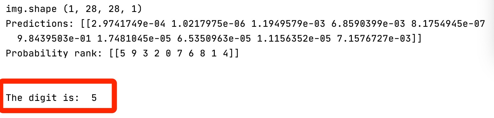

# 数字识别

数字识别是人工智能（AI）领域的Hello World。

数字识别就是开发一个可以识别0到9共10个数字的机器学习系统。

# 使用效果

## 输入


## 输出



对，直接看使用效果。

这也是这个公众号的主要组织形式。（以下是一本正经说教环节）

1. **应用导向**：给出要介绍的AI应用，在现实中的应用是什么样子的。对笔者以及很多学习机器学习的人来说，往往总是看到更多的资料在介绍公式推导，或者是学术论文、博客，即便是开源的代码，依然不知所云，或者学过就忘，不能深入地理解；在需要解决实际问题的时候，往往不知所措。实践是检验真理的最好标准，应用起来（对大部分无法在大脑中很好地抽象、演绎的人来说）才是最好的学习方法。
2. **机器学习优化目标导向**：机器学习其实是一个用数学模型去建模这个世界（相关场景），结合计算机（主要是计算机，也包括物联网、人机交互、线上线下应用、区块链等种种形式）等工具，更好地解决现实世界中的问题。在当下的机器学习算法应用过程中，往往首先需要定义好应用的优化目标。
3. **人生目标导向**：对于漫漫人生路来说，找到（一个甚至多个重要的）奋斗目标是重要的，然后辅之以更好的优化算法，最重要的持之以恒地训练，（基本上）一定能取得很好的泛化效果。人生不是由18岁、28岁、35岁以及其它某个年龄决定的，而是由一个又一个（相对正确的）优化目标，很好（甚至更好的）的优化算法，（最重要的是）持续的训练组成的。


# 使用过程

1. 在电脑上打开画板或者其它软件，调大画笔粗度，写下一个数字，如**5**，图片如上所示。

2. 运行测试文件（或者脚本），可以展示**预测的数字**是多少，以及每一个数字的概率。


# 模型训练

## 定义模型

用tensorflow2.0+，以tf.keras形式，简单的卷积神经网络。几个卷积层(Conv)、池化层(Pool)，以及全连接层（Dense），最后一层激活函数选择用softmax，得到10个数字的预测概率。英文注释也很简单，对应着看就可以了。

```python
def build_model():
    # inputs: [batch_size, height, width, num_channels], default `channels last`
    # inputs: [None, 28, 28, 1]
    height = 28
    width = 28
    num_channels = 1
    inputs = layers.Input(shape=(height, width, num_channels))

    # conv_1: [None, 26, 26, 32=filters=output_size]
    # out = (in - K + 2P) / S + 1 = (28 - 3 + 2*0) / 1 + 1 = 26
    conv_1 = layers.Conv2D(filters=32, kernel_size=(3, 3), padding='valid',
                           activation='relu', name='conv_1')(inputs)

    # pool_1: [None, 13, 13, 32]
    pool_1 = layers.MaxPool2D(pool_size=(2, 2), padding='valid',
                              name='pool_1')(conv_1)

    # conv_2: [None, 11, 11, 64]
    # (13 - 3 + 2*0) / 1 + 1 = 11
    conv_2 = layers.Conv2D(filters=64, kernel_size=(3, 3), padding='valid',
                           activation='relu', name='conv_2')(pool_1)

    # pool_2: [None, 5, 5, 64]
    pool_2 = layers.MaxPool2D(pool_size=(2, 2), padding='valid',
                              name='pool_2')(conv_2)

    # conv_3: [None, 3, 3, 64]
    # (5 - 3 + 2*0) / 1 + 1 = 3
    conv_3 = layers.Conv2D(filters=64, kernel_size=(3, 3), padding='valid',
                           activation='relu', name='conv_3')(pool_2)

    # flatten: [None, 576=3*3*64]
    flatten = layers.Flatten(name='flatten')(conv_3)

    # fc_1: [None, 64]
    fc_1 = layers.Dense(units=64, activation='relu', name='fc_1')(flatten)

    # dropout: [None, 64]
    dropout_rate = 0.2
    dropout = layers.Dropout(rate=dropout_rate, seed=0, name='dropout')(fc_1)

    # softmax: [None, 10]
    num_class = 10
    softmax = layers.Dense(units=num_class, activation='softmax', name='softmax')(dropout)

    model = models.Model(inputs=inputs, outputs=softmax, name='mnist_cnn')

    return model
```


## 数据预处理

用AI的Hello world数据集mnist，为了直接复用mnist的数据处理方法，将下载到的mnist.npz数据放到keras安装目录`~/.keras/datasets`下面。

读取到的数据是numpy格式的，转换成tensor格式。

```python
def load_preprocess_data():
    # Put 'mnist.npz' in your ~/.keras/datasets.
    (x_train, y_train), (x_test, y_test) = mnist.load_data(path='mnist.npz')

    x_train = convert_x(x_train)
    x_test = convert_x(x_test)

    y_train = convert_y(y_train)
    y_test = convert_y(y_test)

    return (x_train, y_train), (x_test, y_test)

def convert_y(np_y):
    # y must be float32
    tensor = tf.convert_to_tensor(np_y, dtype=tf.float32)

    return tensor
```

转换成tensorflow2.0+最合适的训练格式tf.dataset。

```python
def convert_to_data_set(x, y, repeat_times=None,
                        shuffle_buffer_size=None, batch_size=None):
    x_tensor = tf.convert_to_tensor(x)
    y_tensor = tf.convert_to_tensor(y)
    data_set = tf.data.Dataset.from_tensor_slices((x_tensor, y_tensor))\
        .repeat(repeat_times)\
        .shuffle(shuffle_buffer_size)\
        .map(transfer, num_parallel_calls=tf.data.experimental.AUTOTUNE)\
        .batch(batch_size)\
        .prefetch(buffer_size=tf.data.experimental.AUTOTUNE)

    return data_set

def transfer(x, y):
    return x, y
```

## 模型训练

1. 优化器选择Adam（这里学习率learning_rate一定要选择小一点，太大的话学习效果太差）。
2. 损失函数选择稀疏类别交叉熵SparseCategoricalCrossentropy，用来对应softmax学习到的10个数字类别的概率。

其它的都是(tf.)keras深度学习模型训练的基本要素。

`Run`就完事了。

```python
def train_model():
    model = build_model()
    print(model.summary())

    optimizer = optimizers.Adam(learning_rate=0.001)
    loss = losses.SparseCategoricalCrossentropy(from_logits=True)

    model.compile(optimizer=optimizer, loss=loss, metrics=['acc'])

    (x_train, y_train), (x_test, y_test) = load_preprocess_data()

    epochs = 10
    n_train = 60000
    n_test = 10000
    batch_size = 32
    steps_per_epoch = n_train // batch_size
    validation_steps = n_test // batch_size

    train_data_set = convert_to_data_set(x_train, y_train, repeat_times=epochs,
                                  shuffle_buffer_size=n_train,
                                  batch_size=batch_size)

    val_data_set = convert_to_data_set(x_test, y_test, repeat_times=epochs,
                                  shuffle_buffer_size=n_test,
                                  batch_size=batch_size)

    my_callbacks = []
    early_stopping_cb = callbacks.EarlyStopping(monitor='val_loss',
                                                patience=5, restore_best_weights=True)
    my_callbacks.append(early_stopping_cb)

    tensorboard_cb = callbacks.TensorBoard(log_dir='logs')
    my_callbacks.append(tensorboard_cb)

    checkpoint_path = 'models/base_cnn/ckpt'
    checkpoint_cb = callbacks.ModelCheckpoint(filepath=checkpoint_path,
                                              save_weights_only=True,
                                              save_best_only=True)
    my_callbacks.append(checkpoint_cb)

    history = model.fit(train_data_set,
              epochs=epochs,
              steps_per_epoch=steps_per_epoch,
              validation_data=val_data_set,
              validation_steps=validation_steps,
              callbacks=my_callbacks)

    print('\n\n')
    train_result = model.evaluate(x_train, y_train)
    format_result(train_result, name='train')

    val_result = model.evaluate(x_test, y_test)
    format_result(val_result, name='val')

    return history
```

# 模型测试

## 加载模型

复制模型定义，从保存好的路径恢复模型参数即可。

```python
def load_model():
    model = build_model()

    optimizer = optimizers.Adam(learning_rate=0.001)
    loss = losses.SparseCategoricalCrossentropy(from_logits=True)

    model.compile(optimizer=optimizer, loss=loss, metrics=['acc'])

    (x_train, y_train), (x_test, y_test) = load_preprocess_data()

    checkpoint_dir = 'models/base_cnn/'
    checkpoint = tf.train.latest_checkpoint(checkpoint_dir=checkpoint_dir)
    model.load_weights(checkpoint)

    return model
```

## 加载待测试图片

1.将待测试图片转换成8位灰度、大小变换成(28, 28)。

2.待测试图片一般都是白底黑字，而mnist原始图片是黑底白字的，需要然后转换下黑白像素。

3.做一些归一化，维度对齐等工作。 


```python
def load_image(image_path=None):
    img = Image.open(image_path).convert('L') # L: 8-bit, gray
    img = img.resize((28, 28))
    img = 255 - np.array(img) # revert the black and white pixel
    img = img/255 # normalize
    img = img[np.newaxis, :, :, np.newaxis] # [batch_size=1, 28, 28, channels=1]
    return img
```

## 模型测试

选择softmax预测得到概率最大的结果。

```python
def test_model(image_path=None):
    model = load_model()
    img = load_image(image_path=image_path)
    print('img.shape', img.shape)
    predictions = model.predict(img)

    print('Predictions:', predictions)
    print('Probability rank:', np.argsort(-predictions))
    print('\n\nThe digit is: ', np.argmax(predictions), '\n\n\n')
```

# 总结

首先要说：Hello, The World of AI!

1. 模型效果：关于数字识别这个应用，模型本身对于真实手写数据预测准确性还有待提高，关于模型架构、调参、数据增强等，还有很多需要完善的地方。不过，首先这里架起的是一个从AI Hello World样例走向真实世界应用的桥梁，而不仅仅是样例本身。相信有一定（不需要太多）基础的人，看到这里，（很大可能）能够激起一个自己动手开发这个应用的想法（对的，You can, you Up!）。
2. 模型使用：样例虽然简单，但是使用可以丰富起来：做成离线应用，识别自己的手写数字；做成web应用、手机应用或者微信小程序；摆个地摊，做入门教学（一点都不low，万事开头难，能从入门到会用而不放弃是功德无量的）都是可以的。