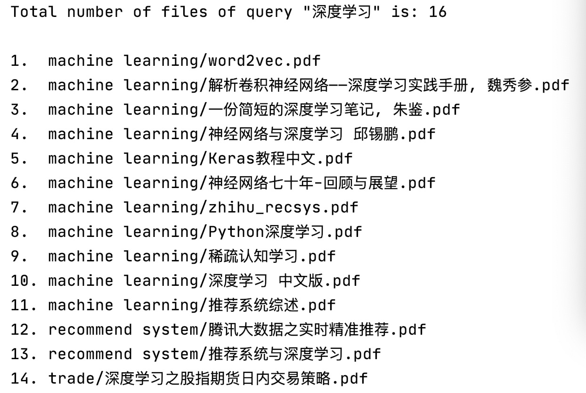

# 本地搜索引擎

搜索引擎像数据库一样，是一个工程与算法的集大成者，是自我学习的非常好的项目。

本篇介绍一个简单的**本地搜索引擎**。（后续会不断扩展，力图打造一个比较强大的本地搜索引擎。）


# 1. 使用效果

## 1.1 输入

输入查询词，如

> 深度学习

## 1.2 输出

返回在本地（你的电脑上）包含该查询的文件路径，如




# 2. 使用过程

1. 建立索引。
2. 基于索引进行查询。

# 3. 建立索引

## 3.1 数据结构

目前的索引是比较简单粗暴的，没有用到数据库，直接用词典形式的文件，有两个重要的数据结构。

> 文件路径到id的映射：doc2id_dict，每个文件有一个唯一的id，也用来记录文件是否已经处理过；检索阶段，依靠该数据结构根据检索到的文件id反查相应的文件路径。

> 倒排索引（词语到文件id的映射）：inverted_index，为每一个词语记录所在文件id的有序列表。

## 3.2 递归遍历目录

doc2id_dict保存的是文件的绝对路径的映射。

```python
def _build_by_dir(self, dir_path=None, model_dir_path=None, doc_type=None):
    batch_size = 10
    i = 0
    for file_path in glob.glob(dir_path, recursive=True):
        if file_path in self.doc2id_dict:
            continue
        i += 1

        print(i, file_path)
        try:
            self._build_by_doc(file_path=file_path, doc_type=doc_type)
            self.doc2id_dict[file_path] = self.doc_id
            self.doc_id += 1
        except:
            print("Wrong", file_path, '\n')

        if i % batch_size == 0:
            # Flush model to disk
            self.save_model(model_dir_path=model_dir_path)

    # Flush the rest to disk
    self.save_model(model_dir_path=model_dir_path)
```

## 3.3 处理文件

目前处理的是pdf文件（因为笔者电脑里有太多的pdf文件，大部分都是论文或者教材原著，下载等于看过）。

```python
def _build_by_doc(self, file_path=None, doc_type=None):
    if doc_type == 'pdf':
        text_generator = pdf_extractor(file_path=file_path, max_page_number=self.max_page_number)
        self._process_text(text_generator=text_generator)
```

使用**pdfplumber**来抽取pdf文件的文字。

> pip install pdfplumber

```python
import pdfplumber

def pdf_extractor(file_path=None, max_page_number=None):
    with pdfplumber.open(file_path) as f:
        for i, page in enumerate(f.pages):

            if i == max_page_number:
                break

            text = page.extract_text()

            yield text
```

暂时只建立词语到文件id的映射，同一词语如果在文件中出现多次，只处理一次。

```python
def _process_text(self, text_generator=None):
    # Make sure a word only exists once in one document.
    word_dict = {}

    for text in text_generator:
        if text is None or len(text) == 0:
            continue

        for word in process_text(text=text):
            if word in word_dict:
                continue
            word_dict[word] = True

            if word not in self.inverted_index:
                self.inverted_index[word] = [self.doc_id]
            else:
                self.inverted_index[word].append(self.doc_id)
```

使用**jieba**进行分词（后续可以替换成自己开发的分词算法）。

> pip install jieba

限制了下词语不能太长。

```python
import jieba

def process_text(text=None, max_word_len=30):
    # Segmentation
    for word in jieba.cut(text):
        if word is None or len(word) == 0:
            continue

        word = process_word(word)

        if len(word) > max_word_len:
            continue

        yield word
```

考虑到如果是英文词语，要进行一些特定的处理，如词干还原等，目前只做了大写转小写:)。

```python
def process_word(word):
    word = word.lower()

    return word
```

这样就建立好了笔者电脑里吃灰的pdf文件，大约1300篇（为速度起见，限制了每个文件只处理最多10页），顺序处理用了将近8000秒，建立好的doc2id_dict序列化文件大约160KB，倒排索引文件超过170MB（后续要在索引存储与建立上进行时空优化，要不然没法商业化了:P）。

# 4. 查询

有了索引文件之后，查询就很简单了（开一个搜索引擎公司真这么简单？）。

首先将序列化的索引文件反序列化，并加载到内存里。

1. 对于查询短语，按照建立索引时对文本相同的处理方式（分词、大写转小写等），切割成不同的查询词。

2. 为所有的查询词在倒排索引词典里查找有序的文件id列表。

3. 依次合并文件id列表，得到包含所有查询词（构成了查询短语）的文件id列表。

4. 将文件路径映射词典键值对反转，从文件id反查文件路径。Done。

```python
def search(self, query=None):
    ans = None

    processed_query = process_text(query)

    for word in processed_query:
        word = word.lower()
        if word in self.inverted_index:
            doc_id_list = self.inverted_index[word]
            if ans is None:
                ans = doc_id_list
            else:
                ans = intersect_sorted_list(ans, doc_id_list)

    return ans
```

合并查询词的有序文件列表时，终于找到了刷了无数遍的合并（两个）有序数组的现实应用。

```python
def intersect_sorted_list(a, b):
    ans = []
    i = 0
    j = 0

    while i < len(a) and j < len(b):
        if a[i] == b[j]:
            ans.append(a[i])
            i += 1
            j += 1
        elif a[i] < b[j]:
            i += 1
        else:
            j += 1

    return ans
```

# 5. 总结

本文介绍了一个最简单的基于倒排索引的本地搜索引擎，可以实现对本地文件进行最简单的检索。

搜索引擎其实是一个对工程与算法要求都特别高的领域，在这个领域做的好的公司技术实力是真的强。对个人来说，通过动手做搜索引擎，可以见到太多数据结构、计算机概念以及机器学习算法在现实中的应用。完美：）