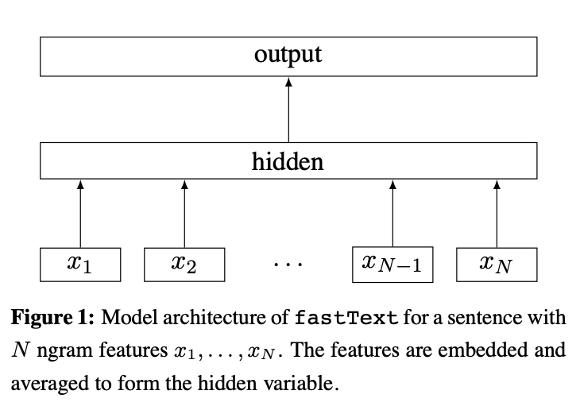

# 一个简单的用“深度学习”进行文本分类的方法

# 1. 效果演示

## 1.1 输入

给定一个文本，判断属于给定类别中的哪一个。

如给定文本：

> 意媒曝皇马如购卡卡失败将攻伊布 惊人代价高达6700万	意媒曝皇马如购卡卡失败将攻伊布 惊人代价高达6700万　　新浪体育讯　周一的《米兰体育报》报道，皇马已经向国际米兰提出了用4000万欧元加斯内德交换伊布的请求。这份意大利体育报纸披露，弗罗伦蒂诺之所以想要引进伊布，是为了给可能的卡卡转会受挫备下替代方案。也就是说，如果皇马无法引进卡卡，那弗罗伦蒂诺将转向进攻伊布。

模型判断属于['体育', '时尚', '财经']中的哪一个。

## 1. 2 输出

样例很明显属于`体育`类。

# 2. 数据

使用THUCTC数据集（[http://thuctc.thunlp.org/](http://thuctc.thunlp.org/)），这是清华大学自然语言处理实验室推出的中文文本分类工具包附带的数据集，包含了14个类别的新闻数据。

14个新闻类别如下：

```
> 体育   娱乐   家居   彩票   房产   教育   时尚   
> 时政   星座   游戏   社会   科技   股票   财经
```

一共包含836075篇文章，笔者按照4：1：1的比例随机切分得到了训练集、验证集与测试集。

# 3. 基于FastText的文本分类

Word2vec [1]的作者Mikolov基Word2vec提出的FastText [2]分类方法。整体上被一些学术界的人质疑创新性**不太够，但并不影响这是一个实用的、容易得到很好效果的文本分类方法，尤其是长文本分类。

FastText的主要贡献在于：

1. 表明即使是简单的基于词的embedding的平均值，也可以很好地表示整个文本，进而用于文本分类；
2. 使用N-gram进行特征提取，可以稍微弥补Bag-of-words所导致的文本词序缺失带来的信息损失。


下图是FastText论文中给出的模型架构。




# 4. 数据预处理

1. 将每篇新闻文本合并到一行，得到标签、正文（标题与正文合并到一起）。

   > label \t  text

2. 对标题、正文进行中文分词，去除停用词，词语之间用空格分隔。得到如下的数据：

   > 科技    中秋 国庆 黄金 双周 出游 三成 机票 网友 抢走 中秋 国庆 黄金 双周 出游 三成 机票 网友 抢走 中秋 国庆 放假 安排 密度 大 、 间隔 短 ， 称为 史上 最 零碎 长 假期 。 很多 人 避开 国庆 旅游 黄金
   > 周 ， 休假 出行 计划 提前 中秋 。 淘宝 旅行 平台 数据 显示 ， 机票 、 箱包 旅游 相关 产品 热 抢 阶段 ， 中秋 国庆 半个 月 ( 9 月 15 日 ~ 10 月 15 日 ) 机票 售出 三成 ， 北京 上海 、 深圳 热门 航线 售
   > 出 超过 50% 。 淘宝 仍 便宜 票在售 记者 调查 发现 ， 双 黄金周 期间 ， 航班 30% 机票 售出 ， 上海 、 北京 热门 航班 更是 票源 吃紧 。

3. 使用预训练的词向量 [3]，对每一篇文章，对于分词结果，查询词向量，计算平均值。简单起见，对标题与正文合并处理。得到

   > label \t 文本向量表示，300维向量，以逗号分隔。

   数据示例：

   > 科技    -0.015852956,0.111438766,-0.021455063,-0.0050904024,-0.30068386,0.0450483,-0.056035586,0.19103067,-0.05296858,0.031689357,0.016048187,-0.14343895,-0.07969891,-0.10407096,-0.026082741,0.13580397,0.014486666,0.13451266,-0.04794995,0.028937954,0.20230992,0.07742328,-0.09250792,-0.03761031


# 5. 基于Word2vec+MLP模型训练

## 5.1 模型定义


本文介绍基于Word2vec预训练词向量+MLP的文本分类方法，与FastText方法类似但不完全一样。模型定义如下：

1. 预训练表示层，计算文本分词之后向量均值。也可以选择设置Trainable=False的Embedding层来实时查询词向量，进而计算均值；但这样做需要定义输入序列最大长度来包含所有词语，对长度不足的序列进行补齐，在计算的时候还需要剔除补齐字段，因而控制起来相对复杂一些。本文采用预先计算好向量均值的方式。
2. 加一层Dense，加入一点非线性。
3. 加一层Dropout，抑制过拟合。
4. 最后是Softmax层，对应14个类别。


```python
class PretrainedFastText(tf.keras.Model):
    def __init__(self, num_classes=14):
        super(PretrainedFastText, self).__init__()

        dropout_rate = 0.2

        self.dense_1_layer = Dense(units=128, activation='relu')
        self.dropout_1 = Dropout(dropout_rate)

        self.softmax_layer = Dense(units=num_classes, activation='softmax')

    def call(self, inputs=None):
        # inputs: [None, 300]

        # [None, 128]
        outputs = self.dense_1_layer(inputs)
        outputs = self.dropout_1(outputs)

        # [None, num_classes]
        outputs = self.softmax_layer(outputs)

        return outputs
```


## 5.2 构造训练样本数据流

1. 预先计算每条样本分词后词语预训练向量的均值，并保存下来。其实向量均值不是一定需要保存的，但保存下来可以做多种输入类型实验，空间换时间。
2. 用生成器generator构造tf.data.Dataset，从而可以灵活地以数据流的形式读取大文件。

```python
def pretrained_dataset_generator(data_path=None,
                      epochs=10,
                      shuffle_buffer_size=1024,
                      batch_size=16):
    # input_data: label \t vec_1, vec_2, ..., vec_300, split by ','
    # Output: inputs, label; [None, 300], [None, 1]

    # {label_name: label_index}
    label_dict = get_label_dict()

    def generator():
        with open(data_path, 'r', encoding='utf-8') as f:
            for line in f:
                buf = line[:-1].split('\t')
                label_name = buf[0]
                label = int(label_dict[label_name])

                inputs = np.array(list(map(lambda x: float(x), buf[1].split(','))),
                                  dtype=np.float32)

                yield inputs, [label]

    dataset = tf.data.Dataset.from_generator(generator,
                                             output_shapes=((300, ), (1, )),
                                             output_types=(tf.float32, tf.int32))

    return dataset.repeat(epochs)\
        .shuffle(buffer_size=shuffle_buffer_size)\
        .batch(batch_size=batch_size)
```


## 5.3 模型训练

1. 因为是训练多分类模型，所以loss采用SparseCategoricalCrossentropy。
2. 优化器无脑选择Adam。

```python
# === Training data stream, tf.data.Dataset
train_dataset = get_pretrained_dataset(data_path=train_path,
                                       epochs=epochs,
                                       shuffle_buffer_size=shuffle_buffer_size,
                                       batch_size=batch_size)

val_dataset = get_pretrained_dataset(data_path=val_path,
                                     epochs=epochs,
                                     shuffle_buffer_size=shuffle_buffer_size,
                                     batch_size=batch_size)

# === Define model
model = PretrainedFastText(num_classes=num_classes)

# optimizer
optimizer = tf.keras.optimizers.Adam(0.001)

# loss
loss = tf.keras.losses.SparseCategoricalCrossentropy()

# === Compile model
model.compile(optimizer=optimizer,
              loss=loss,
              metrics=['acc'])

# === Train Model
model.fit(train_dataset,
               epochs=epochs,
               steps_per_epoch=num_train_batch,
               validation_data=val_dataset,
               validation_steps=num_val_batch,
               callbacks=callbacks)
```


# 6. 模型测试

1. 首先将测试文本数据与训练数据进行相同的预处理：分词，去除停用词；
2. 对分词结果中的对每一个词语查询预训练词向量，计算每条文本的向量均值，输入训练好的模型。

# 7. 实验结果

本文介绍了一个简单的基于预训练词向量的文本分类方法Word2vec + MLP。

可以发现，虽然模型很简单，但是由于使用了预训练词向量，相当于用到了非常多的额外的文本信息，从而得到了还不错的分类效果。

但是测试Facebook开源的FastText，发现模型效果更好，而且训练速度特别快。

| 模型         | accuracy(f1_micro) | f1_macro | f1_weighted |
| ------------ | ------------------ | -------- | ----------- |
| Word2vec+MLP | 0.9373             | 0.9216   | 0.9371      |
|              | 0.9496             | 0.9380   | 0.9496      |

当然，这两种模型并不完全具有可比性。

FastText模型是从Word2vec演化而来，但是也用到了一些算法与工程上的trick：（1）为了捕捉更多的词序信息，使用了N-gram；（2）为了加快学习速度，对词语进行了Hash处理。

而本文目前采用的Word2vec+MLP模式还有很大的优化空间：（1）让预训练的Embedding参与训练；（2）让MLP模块更复杂；（3）与FastText一样加入N-gram。

总结一下，对于文本分类，（1）如果训练数据很少，可以采用本文提出的Word2vec+MLP模式，借助预训练信息来提升分类效果；（2）如果有一定的训练数据量，可以用FastText快速得到一个还不错的Baseline。


# 参考资料

[1] Mikolov T , Chen K , Corrado G , et al. Efficient Estimation of Word Representations in Vector Space[J]. Computer ence, 2013.(**word2vec**)

[2] Joulin A , Grave E , Bojanowski P , et al. Bag of Tricks for Efficient Text Classification[J]. 2016. (**FastText**)

[3] Shen Li, Zhe Zhao, Renfen Hu, Wensi Li, Tao Liu, Xiaoyong Du, [*Analogical Reasoning on Chinese Morphological and Semantic Relations*](https://arxiv.org/abs/1805.06504), accepted by ACL 2018. https://github.com/Embedding/Chinese-Word-Vectors （**预训练词向量**）